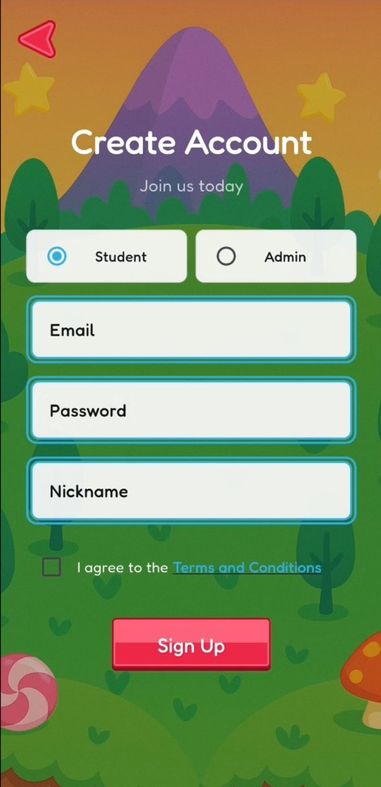
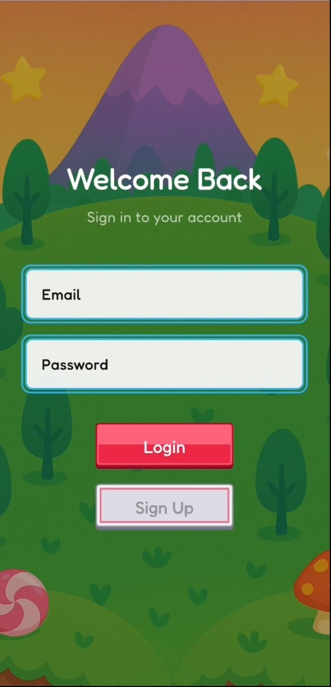
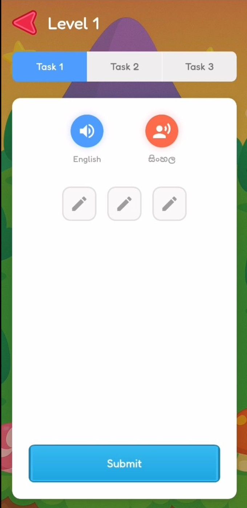
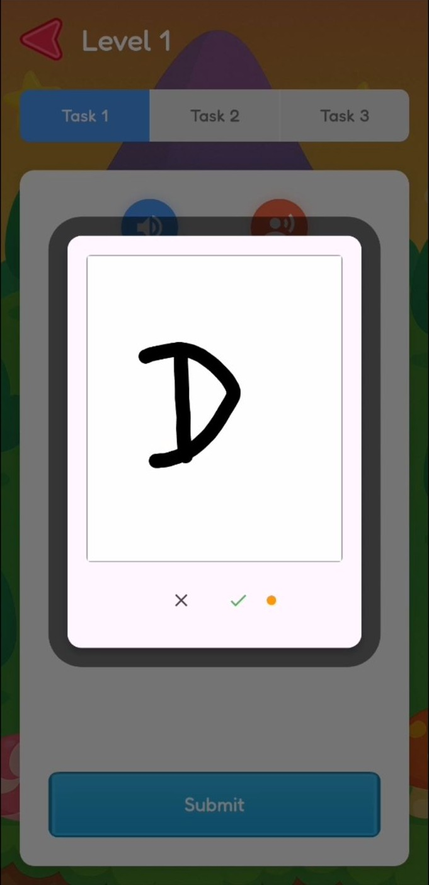
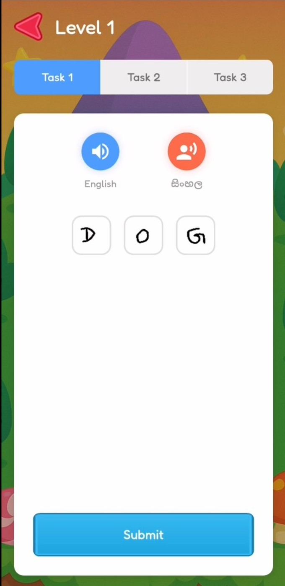
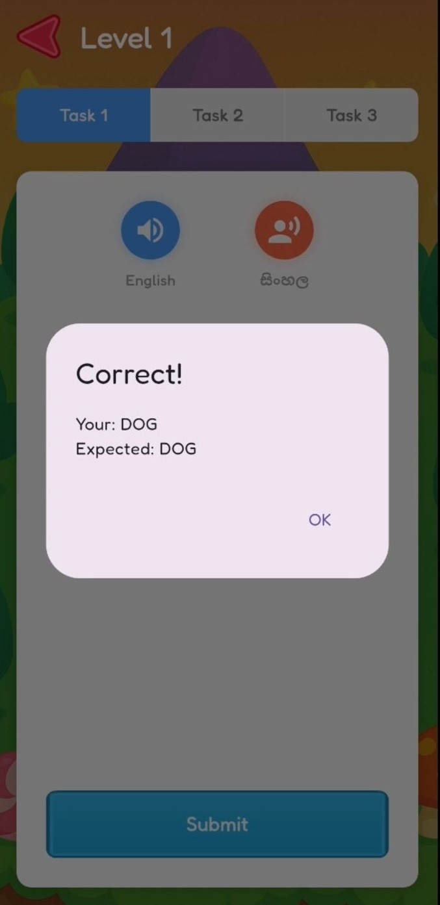
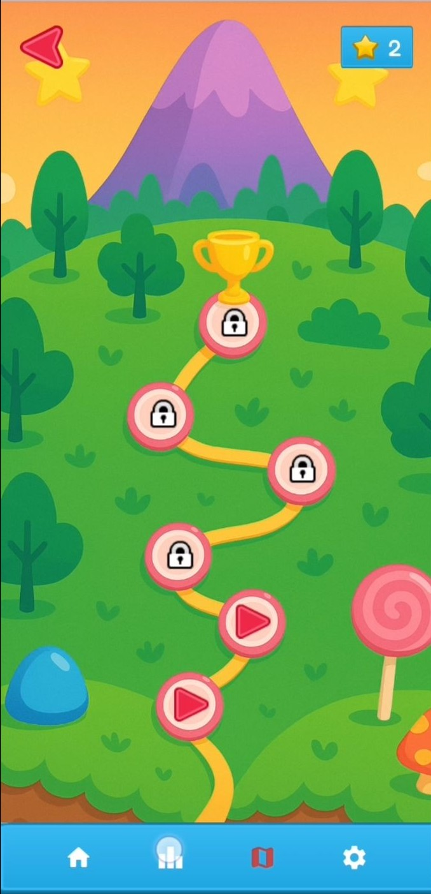
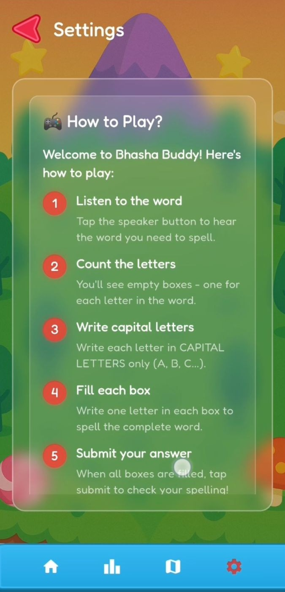
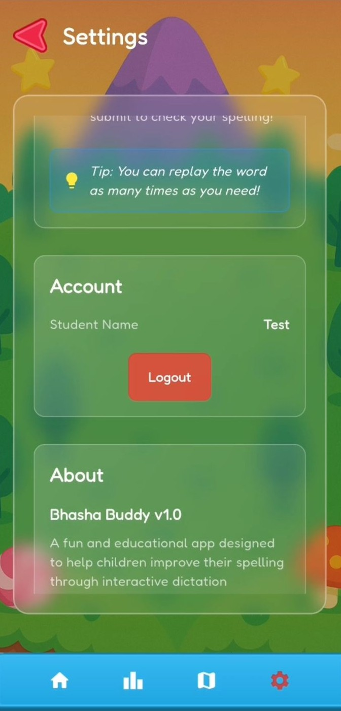

# Frontend Demo & Setup

This is the Flutter frontend of the **BhashaBuddy**, an educational mobile application for children aged 8–14 to practice dictation through handwriting.

## 📱 App Screenshots

<div align="center">
  <table>
    <tr>
      <td></td>
      <td></td>
      <td></td>
      <td></td>
    </tr>
    <tr>
      <td></td>
      <td></td>
      <td></td>
      <td></td>
    </tr>
    <tr>
      <td></td>
      <td></td>
      <td></td>
      <td></td>
    </tr>
    <tr>
      <td></td>
      <td></td>
      <td></td>
      <td></td>
    </tr>
  </table>
</div>

---
## 🚀 Tech Stack

- **Flutter** (Frontend UI)
- **Firebase Auth & Firestore** (User data)
- **FastAPI** (Backend)
- **TensorFlow** (Handwriting recognition)

## ✅ Prerequisites

Before running the app, ensure the following:
### 🔧 1. Backend Setup
- Set up the [FastAPI backend](https://github.com/tfHasi/BhashaBuddy-Backend) and run the server at `http://10.0.2.2:8000` (or use your actual backend IP/host).
- Backend must expose:
  - REST endpoints (`BASE_URL`)
  - WebSocket endpoints (`WS_URL`)
  - AI inference logic
  - Firebase Admin SDK access
### 🔥 2. Firebase Configuration
To set up Firebase for authentication and Firestore:

1. Install Firebase CLI:
   ```bash
   npm install -g firebase-tools
2. Log into Firebase:
   ```bash
   firebase login
3. Initialize Firebase:
   ```bash
   firebase init
This will generate:

firebase.json

google-services.json (for Android)

Update your Flutter project to use these files:

android/app/google-services.json

Ensure firebase_core and related packages are initialized.

## ⚙️ Setup Instructions

1. Clone this repository
2. Create a `.env` file in the root and define your backend URL:
   ```env
   BASE_URL= https://your-server.com
   WS_URL = ws://your-server.com
3.Run the app:
   ```bash
    flutter pub get
    flutter run
